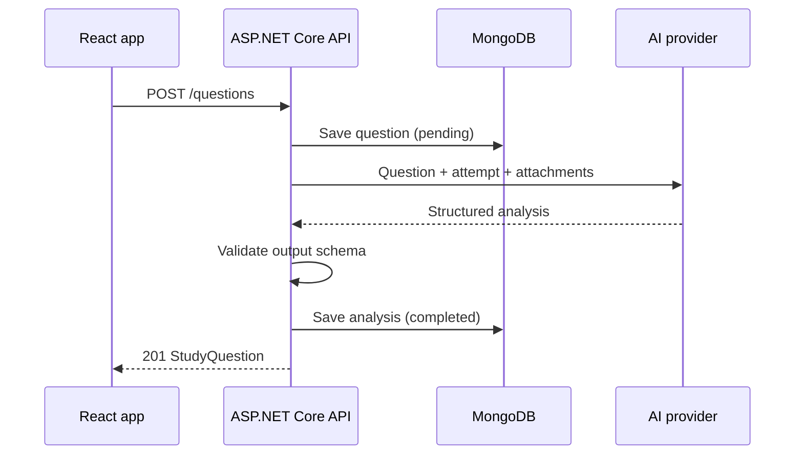
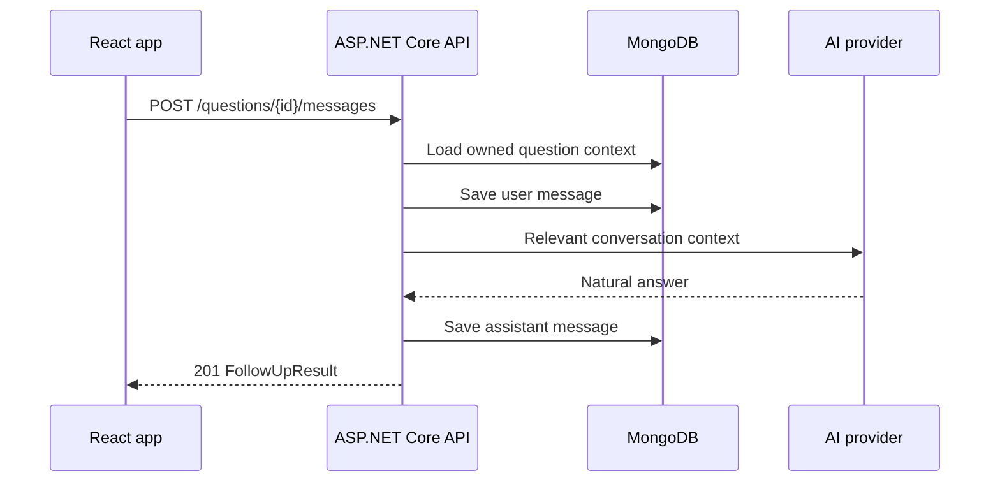

# API Workflow

The current contract is [`studyweave-openapi.yaml`](../../studyweave-openapi.yaml), using OpenAPI 3.0.3.

The contract is the source of truth for exact request and response schemas. This page explains the intended behavior.

## Endpoint summary

| Area | Operations |
|---|---|
| Current user | `GET /users/me`, `PATCH /users/me` |
| Courses | `GET /courses`, `POST /courses` |
| One course | `PATCH /courses/{courseId}`, `DELETE /courses/{courseId}` |
| Topics | `GET /courses/{courseId}/topics`, `POST /courses/{courseId}/topics` |
| One topic | `PATCH /courses/{courseId}/topics/{topicId}`, `DELETE /courses/{courseId}/topics/{topicId}` |
| Questions | `GET /questions`, `POST /questions` |
| One question | `GET /questions/{questionId}`, `DELETE /questions/{questionId}` |
| Conversation | `GET /questions/{questionId}/messages`, `POST /questions/{questionId}/messages` |

There is no public `PATCH` operation for questions and no standalone analysis endpoint in the initial contract.

## Original-question flow

If the AI call fails, the backend should preserve the original question and record a failed analysis state. Exact synchronous/asynchronous response behavior should be finalized in issue #3.

## Follow-up flow

The follow-up response returns the new user and assistant messages. It does not regenerate or return a new full analysis object.

## Listing and retrieval

`GET /questions` provides a lightweight paginated library. Planned filters include course, topic, search text, and review status.

`GET /questions/{questionId}` returns the full question workspace, including original content, analysis, and saved conversation.

Conversation messages also have a cursor-paginated endpoint so a long thread does not require one unlimited response.

## Errors and authorization

- Bearer authentication is currently described by the contract.
- Resource ownership must be enforced server-side.
- Validation and not-found errors use `application/problem+json`.
- AI-provider failures currently use a `422` response in the draft and must be reviewed during API finalization.
- Public route identifiers use UUIDs rather than MongoDB ObjectIds.
