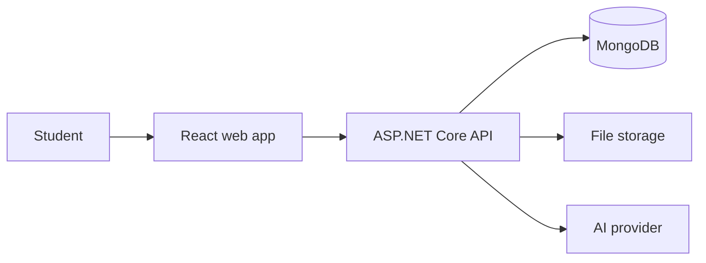
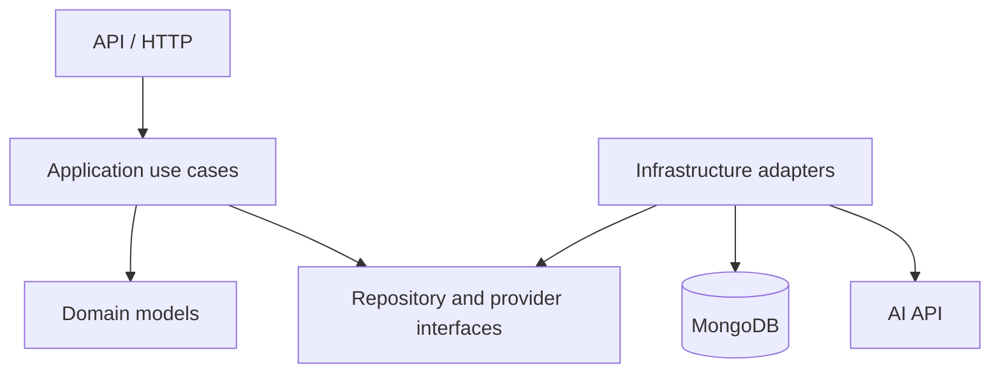

# Architecture

## System context

The browser communicates only with the ASP.NET Core API. Database credentials, storage credentials, and AI-provider keys remain on the server.

## Planned responsibilities

### React web app

- Hebrew RTL presentation.
- Dark theme and accessible user interaction.
- Course, topic, question, analysis, and conversation screens.
- Client-side request state and validation feedback.
- No AI-provider secret or direct database access.

### ASP.NET Core API

- Authentication and resource ownership.
- HTTP request validation and Problem Details errors.
- Question-creation orchestration.
- AI-provider abstraction and structured-output validation.
- Conversation-context construction.
- MongoDB and attachment-storage access.
- Cancellation, timeout, and failure handling.

### MongoDB

- Users, courses, topics, study questions, analyses, and message metadata.
- MongoDB-generated `_id` plus application-generated UUID `id`.
- Indexes for ownership, course/topic filtering, timestamps, and question search.

### File storage

- File bytes for supported question attachments.
- MongoDB stores attachment metadata and storage references, not large file bodies.
- Exact provider and upload flow remain an implementation decision tracked by issue #7.

### AI provider

- Produces the structured initial analysis.
- Answers natural follow-up questions.
- Is accessed behind an application interface so controllers and domain models do not depend directly on one vendor SDK.

## Suggested backend boundaries

A practical first solution may contain API, Application, Domain, and Infrastructure projects. The final split should remain proportional to the size of the MVP; boundaries matter more than the number of projects.

## Question-creation transaction

Question creation crosses MongoDB, file storage, and an external AI provider, so it is not one database transaction.

The intended approach is:

1. Validate ownership and input.
2. Persist the original question with analysis status `pending`.
3. Send relevant content to the AI provider.
4. Validate the structured response.
5. Store the completed analysis and update status to `completed`.
6. If processing fails, keep the student work and mark analysis as `failed`.

This prevents an external-provider failure from deleting the original question.

## Security boundaries

- Authenticate all API operations.
- Check ownership on every user-owned resource.
- Keep provider keys and database credentials outside source control.
- Validate attachment type and size on the server.
- Avoid logging secrets or unnecessary student content.
- Treat model output as untrusted data until it passes schema validation.
