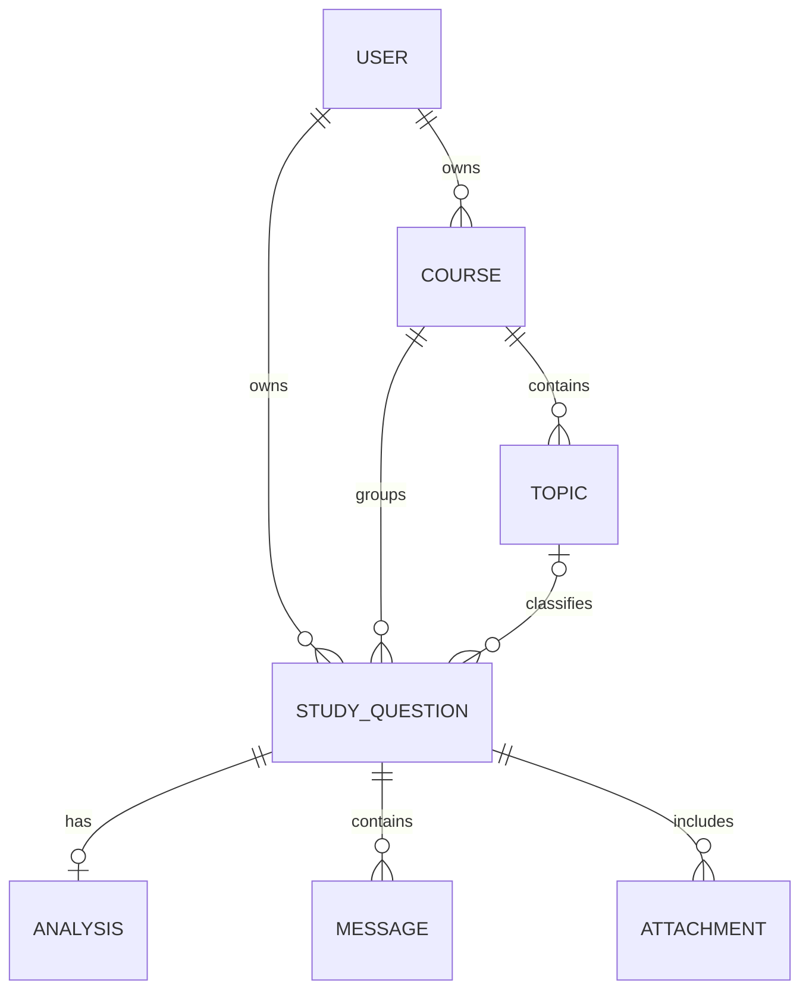

# Data Model

## Identifier convention

Every persisted resource has two identifiers:

| Field | Type | Purpose |
|---|---|---|
| `_id` | MongoDB ObjectId | Internal persistence identity generated by MongoDB |
| `id` | UUID | Public application identity generated by StudyWeave |

API paths and relationship fields use UUIDs. MongoDB ObjectIds remain persistence details.

## Main relationships

## Entities

### User

A deliberately simple profile for the MVP.

Important fields:

- `_id`
- `id`
- `username`
- `email`
- `displayName`
- `createdAt`
- `updatedAt`

### Course

Top-level study grouping owned by one user.

Important fields:

- `_id`
- `id`
- owner identifier
- `name`
- `description`
- timestamps

### Topic

A course-level subdivision.

Important fields:

- `_id`
- `id`
- `courseId`
- `name`
- timestamps

### StudyQuestion

The central aggregate.

Important fields:

- `_id`
- `id`
- owner identifier
- `courseId`
- optional `topicId`
- `title`
- `questionText`
- optional `studentAttempt`
- attachments
- `analysisStatus`
- optional analysis
- conversation messages
- review metadata
- timestamps

Question editing is not part of the initial public API. The current contract allows retrieval and deletion.

### Analysis

The canonical structured feedback created from the original question and attempt.

It is stored separately in meaning from the conversation even if the first persistence implementation embeds it inside the question document.

Important fields:

- `_id`
- `id`
- `version`
- `verdict`
- `shortAnswer`
- `correctParts`
- `firstIncorrectStep`
- `correctedSolution`
- `keyConcepts`
- `lessonToRemember`
- `suggestedReviewQuestion`
- provider/model metadata
- `generatedAt`

### ConversationMessage

One chronological message in a saved question.

Roles:

- `user`
- `assistant`

Initial message types:

- `original_question`
- `initial_analysis`
- `follow_up_question`
- `follow_up_answer`

Each message has its own UUID and creation timestamp.

### Attachment

Metadata for a stored file:

- `_id`
- `id`
- `fileName`
- `contentType`
- storage URL or reference

The storage URL must not expose private credentials.

## Embedding decisions

MongoDB allows analysis and messages to be embedded in the study-question document. That can simplify the first implementation, but conversation growth must be monitored.

Before implementation, decide:

- whether messages remain embedded or use a separate collection;
- how message pagination works;
- how atomic message appends are handled;
- how long conversations are summarized for AI context;
- which fields require indexes.

The API contract should not depend on the final physical collection layout.
